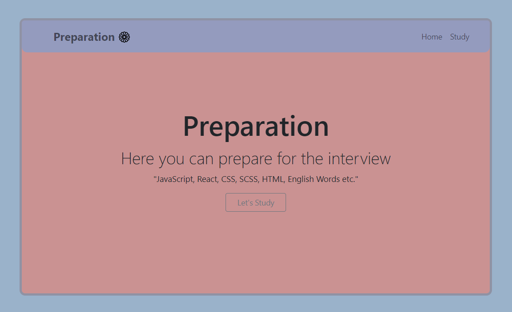
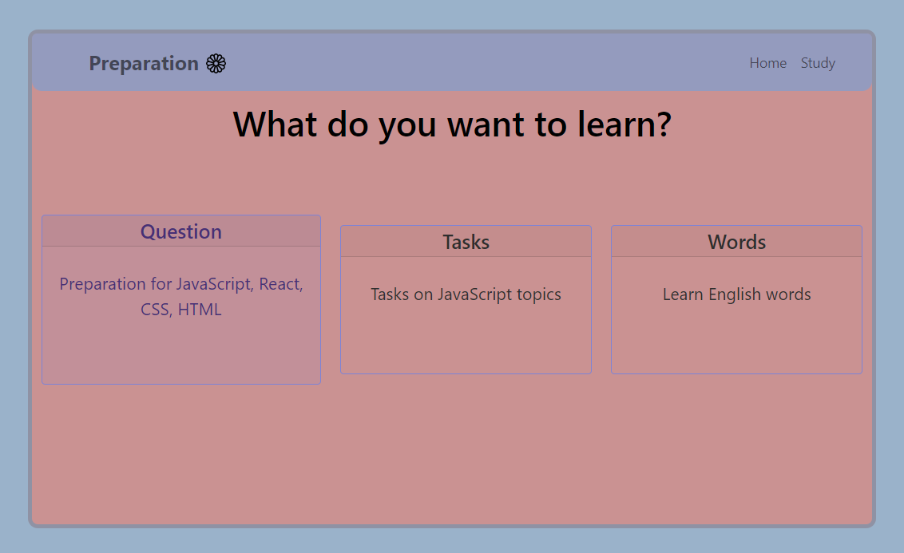

 
   
  
   
  <h1 align="center">"Preparation" is my React project.</h1>
  
Here you can prepare for the interview.

---

<h2 align="start">Website information</h2>

> **_About Project_** :This was my second experience with React. When I created this small site, I did it for myself, to prepare for the interview. I know that this project is useful for me, because I have used new technologies here, such as Redux, and, of course, in the future this project will help me prepare for the interview and become better.

> **_What I used to create this project_** : React, TypeScrip, Bootstrap, SCSS, Redux(RTK Query), Node.js, MongoDB, Mongoose, Eslint, AirBnb, React Router DOM, axios, CORS for React

You can ask me <strong>"What Can I do here",</strong> let me show you every page and you will understand, what you can do:

<strong>- Home</strong> is the first page you see

  

---

<strong>- Study Area</strong> Pages

<ul> 
  <li><h6><em>We see that the user can't go to some pages before authorization, but after authorization the user icon changes and the user can go to another page.</em></h6></li>
  

  

</ul>

---

<strong>- Question </strong>

<ul> 
  <li><h6><em>We see that the user can't go to some pages before authorization, but after authorization the user icon changes and the user can go to another page.</em></h6></li>
  

    
  

</ul>

---

<strong>- Tasks </strong>

> **_Attention_** : - Sorry for some screen recording problems.

<ul> 
  <li><h6><em>The website is multilingual and it is possible to translate into one of three languages.</em></h6></li>
  

    
  

</ul>

---

<strong>- Words </strong>

<ul> 
<h5><em>You Can :</em></h5>
  <li><h6><em>Create Project, Change Title, Change Content or Delete.</em></h6></li>
    

      
    

  <li><h6><em>Project Search.</em></h6></li>
    

      
    

</ul>

---

<strong>- Dashboards </strong>Page

> **_Attention_** : - When you click "Go to Project", I take the project ID from the URL and download all the information from the server side. Also, when you search for a user to assign, the search is performed through the backend.

<ul>
<h5><em>You Can :</em></h5>
  <li><h6><em>Create Column, Change Column Title, or Delete.</em></h6></li>

  

    
  

  <li><h6><em>Create Task, Change Task, Asignee Someone or Delete.</em></h6></li>

  

    
  

  <li><h6><em>Drag and Drop, Task Search.</em></h6></li>
    

      
    

</ul>

---

<strong>- Manage Project </strong>Page

<ul>
<h5><em>You Can :</em></h5>
  <li><h6><em>Find a user and add to the project as: Manager, Developer or QA. Also you can remove from project</em></h6></li>

> **_Attention_** : - If you've added a user as a Developer or QA, that person can't: add, modify, or delete anything, due to lack of rights.

  

    
  

</ul>

---

<strong>- People </strong>Page

<ul>
<h5><em>You Can :</em></h5>
  <li><h6><em>Look at all users and Copy someone's email.</em></h6></li>

  

    
  

</ul>

---

<strong>- Notification</strong>

<ul>
  <li><h6><em>The task is assigned or removed.</em></h6></li>

  
  

  <li><h6><em>Added to the project or removed.</em></h6></li>

  
  

</ul>

---

[Go to Top](#to-top)
